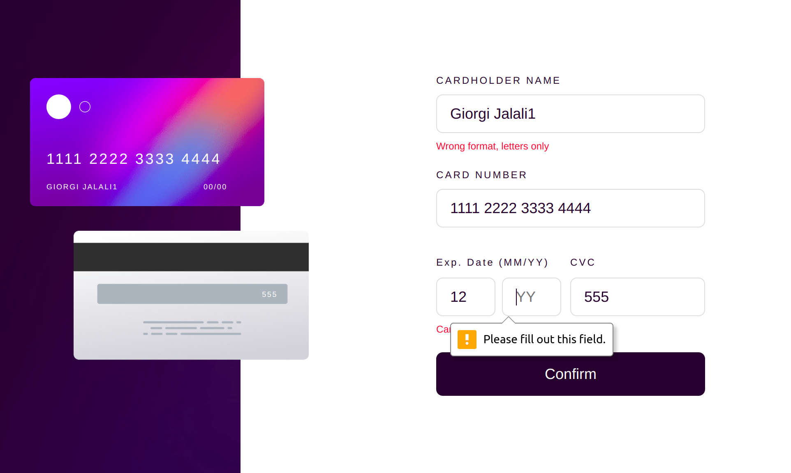

# Frontend Mentor - Interactive card details form solution

This is a solution to the [Interactive card details form challenge on Frontend Mentor](https://www.frontendmentor.io/challenges/interactive-card-details-form-XpS8cKZDWw).

## Table of contents

- [Overview](#overview)
  - [The challenge](#the-challenge)
  - [Screenshot](#screenshot)
  - [Links](#links)
- [My process](#my-process)
  - [Built with](#built-with)
- [Author](#author)

## Overview

### The challenge

Users should be able to:

- Fill in the form and see the card details update in real-time
- Receive error messages when the form is submitted if:
  - Any input field is empty
- View the optimal layout depending on their device's screen size
- Update the details on the card as the user fills in the fields
- Reset the form when the user clicks "Continue" on the completed state

### Screenshot

Device 375px/900px

### Links

- Solution URL: [GitHub](https://github.com/Giorgi-Jalali/interactive-card-details-form-react/tree/master)
- Live Site URL: [GitHub Pages](http://giorgi-jalali.github.io/interactive-card-details-form-react)

## My process

### Built with

- Mobile-first workflow
- [React](https://reactjs.org/) - JS library
- [Styled Components](https://styled-components.com/) - For styles
- react-input-mask (for card number input)

## Author

- LinkedIn - [Giorgi Jalali](https://www.linkedin.com/in/giorgi-jalali-0336b8225/)
